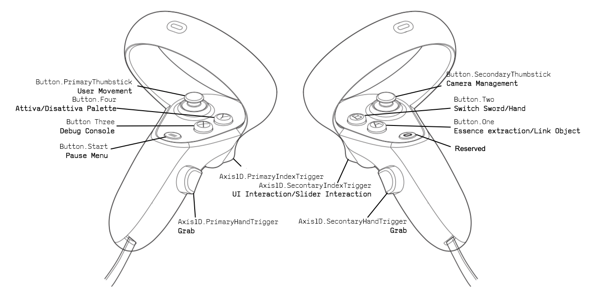

DJRIDOO
===
L’applicazione prevede l’utilizzo di ambienti virtuali per la postproduzione audio, nello specifico l’applicazione di filtri, mixing dei volumi e posizionamento nella timeline dei vari suoni. L’applicazione permetterà all’utente di lavorare su due tipi di audio: il primo, consente di interfacciarsi con suoni già presenti nell’applicazione stessa e pre registrati; il secondo invece, attraverso suoni che l’utente registra e successivamente carica nell’applicazione. 
Nella scena virtuale saranno presenti dei modelli grafici associabili a determinati tipi di suono: a seconda dello strumento che l’utente vuole riprodurre verrà attivata la cassa acustica corrispondente, così da restituire un feedback visivo oltre che uditivo. L’obiettivo è fornire un’interfaccia semplice e intuitiva per applicare tecniche di post produzione e parallelamente permettere all’utente di apprendere le basi dell’elaborazione audio.
La prima scelta per la piattaforma ricade sul visore. In mancanza di quest’ultimo l’esperienza diventerebbe AR e quindi fruibile tramite tablet. Il target a cui ci rivolgiamo è una fascia prosumer di età compresa tra i 20 e 30 anni.

HOW TO USE
---

